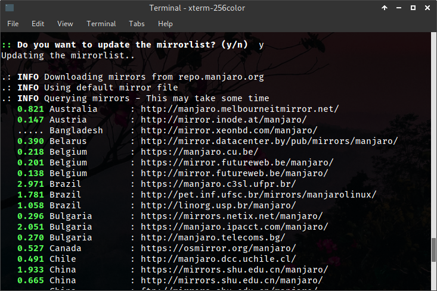
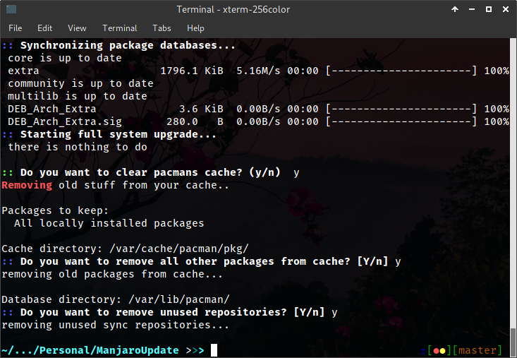

# ManjaroUpdate

This is a small bash script that can update Manjaro Linux, create a new mirrorlist and delete old stuff.
I didn't like typing all the code in everytime, so I created a small bash script - 
maybe you're like me and I can help you with this :)
\
The plan is to create an easy command-line tool for (almost) all Linux Distros.

- [ManjaroUpdate](#manjaroupdate)
    - [Install](#install)
        - [Init](#init)
        - [Use the .desktop file](#use-the-desktop-file)
    - [Example of Usage](#example-of-usage)
        - [Updating the mirrorlist](#updating-the-mirrorlist)
        - [Removing old stuff](#removing-old-stuff)

## Install

You will first need Manjaro installed.
Since I just started looking at bash, it might take a little bit to upload scripts for different linux distributions.

### Init

    $ chmod +x ManjaroUpdate.sh
    $ ./ManjaroUpdate.sh

### Use the .desktop file

Open the file in any texteditor and change the `Exec`-parameter
\
You need to insert the correct path to `ManjaroUpdate.sh`.

Then give the neccessary permissions to run this file:

    $ chmod +x ManjaroUpdate.desktop

Now you have a shortcut and can start the update via double-click.

## Example of Usage

### Updating the mirrorlist

### Removing old stuff

